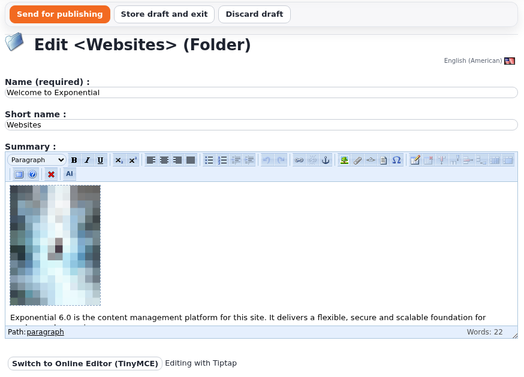

# exp_oe_tiptap

A [Tiptap](https://tiptap.dev/product/editor) based online editor for ezxmltext fields in Exponential 6, next to
the Online Editor (ezoe). Editors switch between the two on the fly, on the same content, without losing what
they typed. Optional AI commands (improve, shorten, extend, fix spelling, translate, summarise, continue) call a
provider of your choice from the server; they are off by default.

**Status: 0.1.0, the first release (compare-ready).** Not for production yet: ezoe stays the default editor
until the round-trip test suite is green on your content. See [doc/plan.md](doc/plan.md) for the phases.

## How it works, in one paragraph

Content stays ezxmltext. ezoe turns ezxml into its editor HTML and parses that HTML back; this extension keeps
both halves exactly as they are and only swaps the thing in the middle: TinyMCE or Tiptap. Tiptap's schema
mirrors ezoe's HTML dialect one to one, so what one editor writes the other reads, and the stored XML is the
same. The input handler `expOETiptapXMLInput` extends ezoe's `eZOEXMLInput` and changes nothing but the edit
template. Details: [doc/architecture.md](doc/architecture.md).

## Screenshot



A text field edited with Tiptap in the admin: the toolbar follows ezoe's layout settings, the AI button sits at its
end when the AI commands are enabled, and the button "Switch to Online Editor (TinyMCE)" below the field goes back
to ezoe with the text kept.

## Quick start

1. ezoe and ezjscore active, and exp_oe_tiptap added to `ActiveExtensions` (any place: it declares that it extends ezoe):
   ```ini
   [ExtensionSettings]
   ActiveExtensions[]=ezjscore
   ActiveExtensions[]=ezoe
   ActiveExtensions[]=exp_oe_tiptap
   ```
2. Regenerate autoloads and clear caches:
   ```bash
   php bin/php/ezpgenerateautoloads.php -e
   php bin/php/ezcache.php --clear-tag=ini --clear-tag=template --allow-root-user
   ```
3. Give editor roles the policy `exp_oe_tiptap/switch` (administrators already have it).
4. Edit an article: below the text field there is a button "Switch to Tiptap". The draft is stored, the form
   comes back with Tiptap. The button there switches back.

Full instructions: [INSTALL.md](INSTALL.md).

## Documentation

| | |
| --- | --- |
| [INSTALL.md](INSTALL.md) | requirements, activation, settings, building, AI, verifying |
| [doc/usage.md](doc/usage.md) | for editors: the switch, what is the same and what differs |
| [doc/configuration.md](doc/configuration.md) | every setting |
| [doc/architecture.md](doc/architecture.md) | how the parts fit |
| [doc/content-mapping.md](doc/content-mapping.md) | the ezoe HTML dialect and its Tiptap schema |
| [doc/ai-hooks.md](doc/ai-hooks.md) | the AI commands, providers, security |
| [doc/extending.md](doc/extending.md) | custom tags, toolbar buttons, AI commands |
| [doc/maintenance.md](doc/maintenance.md) | upgrading Tiptap, rebuilding, tests, troubleshooting |
| [doc/plan.md](doc/plan.md) | plan, phases, risks, open decisions |
| [doc/changelogs/](doc/changelogs/0.1.0.md) | what changed in each release |

## Licence

GNU General Public License v2.0 (or any later version). Copyright (C) 1998 - 2026 7x & Exponential Foundation.

Includes Tiptap and ProseMirror (MIT License) in the built bundle. Tiptap's paid Pro extensions are not used.
